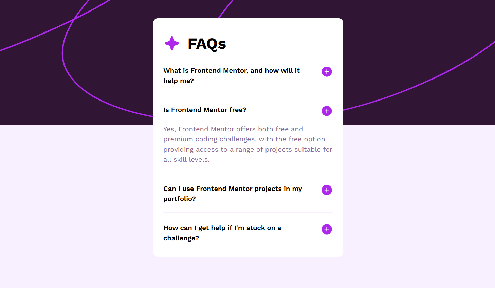
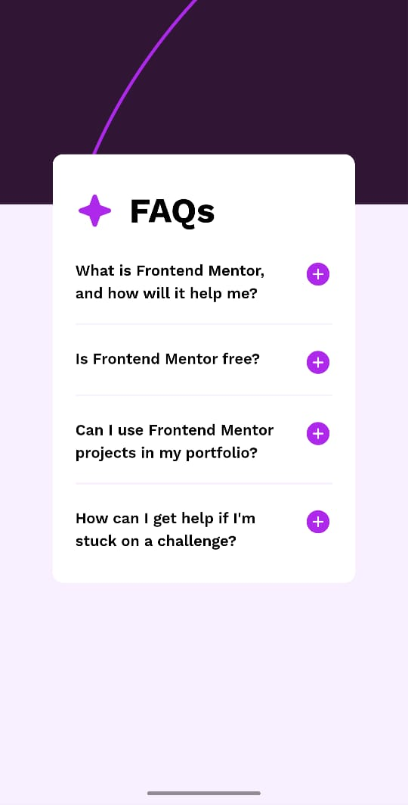

# Frontend Mentor - FAQ accordion solution

This is a solution to the [FAQ accordion challenge on Frontend Mentor](https://www.frontendmentor.io/challenges/faq-accordion-wyfFdeBwBz). Frontend Mentor challenges help you improve your coding skills by building realistic projects. 

## Table of contents

- [Overview](#overview)
  - [The challenge](#the-challenge)
  - [Screenshot](#screenshot)
  - [Links](#links)
- [My process](#my-process)
  - [Built with](#built-with)
  - [What I learned](#what-i-learned)
  - [Continued development](#continued-development)
  - [Useful resources](#useful-resources)
- [Author](#author)
- [Acknowledgments](#acknowledgments)

**Note: Delete this note and update the table of contents based on what sections you keep.**

## Overview

### The challenge

Users should be able to:

- Hide/Show the answer to a question when the question is clicked
- Navigate the questions and hide/show answers using keyboard navigation alone
- View the optimal layout for the interface depending on their device's screen size
- See hover and focus states for all interactive elements on the page

### Screenshot

### Mobile Screenshot

### Links

- Solution URL: [Github](https://github.com/GhettoSpaghetto/FAQ-accordian-fm-challenge)
- Live Site URL: [Netlify URL](https://faq-accordian-fm.netlify.app/)

## My process

### Built with

- Semantic HTML5 markup
- CSS custom properties
- Flexbox
- Mobile-first workflow

### What I learned

I learnt about the details and summary tags which made this challenge a lot more easier as I did not need to use unneccesary markup.
I also learnt about the new css function, calc-size(), which allows us to perform calculations on intrinsic size values such as auto which can used to animate height using only css. However, this feature is not widely supported by browser.

### Continued development

My solution lack any animations because of my limited knowledge of javascript libraries. My aim for now is to overcome this limitation.

### Useful resources

- [Kevin powell](https://www.youtube.com/@KevinPowell) - Kevin Powell has solution for almost anything CSS!

- [Example resource 2](https://css-tricks.com/) - this is amazing website consisting of various tips and tricks on frontend development.

## Author

- Website - [Samarth Kaushal](https://github.com/GhettoSpaghetto)
- Frontend Mentor - [@yourusername](https://www.frontendmentor.io/profile/GhettoSpaghetto)

